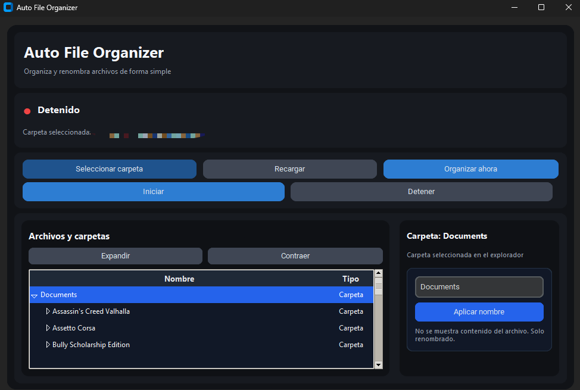

# Auto File Organizer

Auto File Organizer es una pequeña aplicación de escritorio en Python que ayuda a organizar y renombrar archivos en una carpeta seleccionada. Está pensada para ser simple de usar: seleccionar una carpeta, iniciar el monitoreo (opcional) y ordenar archivos por categorías o renombrar elementos directamente desde la interfaz.



## Resumen
- Interfaz minimalista con explorador de carpetas (árbol) y panel de renombrado.
- Monitoreo en tiempo real de una carpeta para organizar archivos automáticamente.
- Logging centralizado a archivo y consola (`data/auto_file_organizer.log`).

## Requisitos
- Python 3.10+ (probado en 3.10/3.11)
- Dependencias (ver `requirements.txt`)

Instalar dependencias (entorno virtual recomendado):

```bash
python -m venv .venv
.venv\Scripts\activate    # Windows
# or
source .venv/bin/activate  # Unix
pip install -r requirements.txt
```

## Ejecutar

```bash
python main.py
```

La aplicación abrirá una ventana. Pasos básicos:

- Haz clic en `Seleccionar carpeta` y elige la carpeta que quieres monitorizar/organizar.
- Usa `Organizar ahora` para ejecutar la clasificación manualmente.
- `Iniciar` / `Detener` habilitan el monitor en segundo plano que moverá archivos nuevos a las carpetas por categoría.
- En el árbol de la izquierda navega las carpetas; selecciona un elemento para renombrarlo desde el panel derecho.

### Renombrado desde la interfaz

- Selecciona un archivo o carpeta en el árbol.
- En el panel derecho escribe el nuevo nombre y pulsa `Aplicar nombre`.
- Restricciones importantes:
  - No puedes renombrar la carpeta raíz seleccionada desde la UI (para evitar incoherencias de ruta).
  - El nuevo nombre no puede contener separadores (`/` o `\`).
  - Si ya existe un archivo o carpeta con ese nombre, la operación será rechazada.

## Estructura del proyecto

- `main.py` — arranca la aplicación y configura el logging.
- `ui/app.py` — interfaz de usuario (CustomTkinter). Aquí se creó el explorador y panel de renombrado.
- `core/monitor.py` — monitor de archivos usando `watchdog`.
- `core/organizador.py` — lógica de organización (mover archivos a carpetas por categoría).
- `utils/logging_config.py` — configuración central del logger (archivo + consola).
- `utils/configuracion.py` — carga/guarda la última carpeta usada (archivo en `~/.auto_file_organizer/configuracion.json`).
- `utils/categorias.py` — mapa de categorías por extensión y utilidades.
- `data/` — carpeta donde el programa guarda el log `auto_file_organizer.log`.

## Registro / Logs

El log principal se escribe en `data/auto_file_organizer.log` (archivo UTF-8) y se emite también a consola. Usa este archivo para diagnosticar fallos o ver operaciones realizadas por el monitor.

## Notas de diseño

- La UI está modularizada en `ui/app.py` con métodos que crean secciones (`_crear_encabezado`, `_crear_panel_arbol`, `_crear_panel_renombrado`, etc.) para facilitar mantenimiento.
- La lógica de organización está separada de la presentación en `core/organizador.py` y `core/monitor.py`.

## Contribuir

Si quieres mejorar la app:

1. Haz un fork y crea una rama por feature.
2. Mantén la estructura modular (UI vs core vs utils).
3. Añade tests o ejemplos cuando cambies lógica de organización.

## License

Proyecto personal — uso completamente libre.
